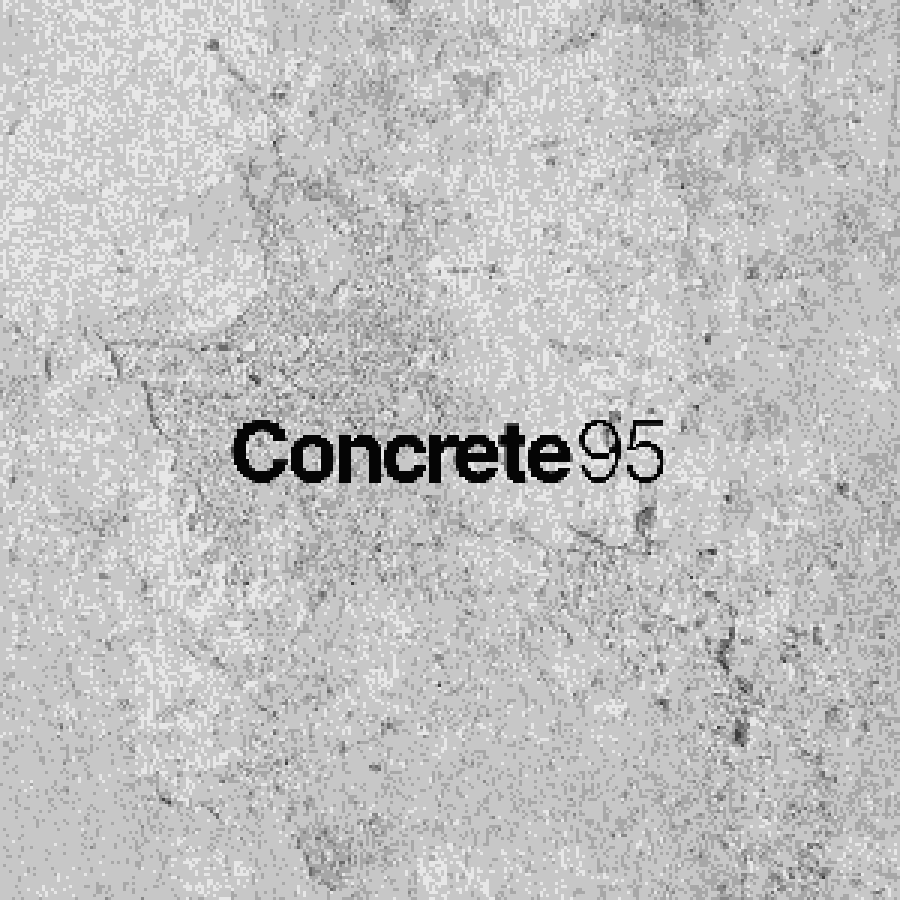

# Concrete 95



A Windows 95-style ambient soundscape app. Layer field recordings, synthesizers, and atmospheric textures through a drag-and-drop desktop interface — complete with a boot screen, draggable windows, and a real-time visualizer.

## Features

- **Layered audio engine** — mix multiple ambient sound layers with independent volume, effects, and BPM-synced timing
- **Win95 desktop UI** — draggable, resizable windows; taskbar; retro chrome throughout
- **Visualizer** — 8 WebGL modes: Plasma, Starfield, Tunnel, Lava Lamp, CRT Dither, Kaleidoscope, Julia Set, and Mandelbrot zoom
- **Scope.exe** — Lissajous oscilloscope with phosphor trail decay
- **Boot screen** — MS-DOS pre-loader typewriters `concrete95.exe` while assets preload, then fades into the Win95 splash

## Stack

- [Next.js](https://nextjs.org) (App Router)
- WebGL fragment shaders for all visualizers
- Web Audio API via Tone.js
- Deployed on [Firebase App Hosting](https://firebase.google.com/docs/app-hosting)

## Local development

```bash
npm install
npm run dev
```
